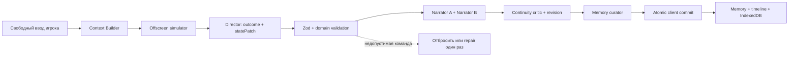

# Архитектура «Летописи»

## Главный инвариант

Художественный текст не является авторитетным состоянием игры. Предмет существует, ресурс изменён, квест завершён или отношение NPC выросло только после того, как соответствующее типизированное событие прошло проверку игрового движка.

## Разделение ответственности

### Сервер

- хранит системные договоры рассказчика;
- собирает только релевантный контекст;
- нормализует OpenAI-совместимые провайдеры;
- получает и проверяет план хода;
- защищает ссылки на несуществующие предметы, NPC, квесты и способности;
- не позволяет автоматически уничтожать редкие и сюжетные предметы;
- передаёт рассказчику уже утверждённый план;
- не хранит кампании и API-ключи.

### Клиентский state engine

- повторно проверяет ID и числовые границы;
- атомарно применяет изменения;
- создаёт snapshot до каждого хода;
- связывает текст, diff, память и timeline одним номером хода;
- сохраняет готовую кампанию в IndexedDB;
- восстанавливает все агрегаты при Undo.

### Интерфейс

- основная проза остаётся визуальным центром;
- «Живой шов» связывает scene output со state diff;
- правый inspector показывает сцену, героя, рюкзак и кодекс;
- пользователь может исправить состояние вручную;
- техническая сложность провайдеров скрыта в настройках.

## Контекстный бюджет

`shared/context.ts` выполняет предсказуемый локальный retrieval:

- `alwaysOn`-лор включается всегда;
- точные ключи имеют максимальный приоритет;
- русские словоформы сопоставляются по осторожному общему стему;
- lexical overlap активирует запись без явного ключа;
- память ранжируется по релевантности и важности;
- профиль определяет отдельные лимиты для дословной истории, lore, memories, archives и canon chunks;
- `million` оставляет модели бюджет до 2,8 млн знаков, но не заполняет его нерелевантными старыми сценами;
- свежая история содержит до 260 сообщений, а старые события возвращаются через scene/chapter/era archives;
- исходные сообщения никогда не удаляются из локальной кампании.

Следующее расширение — опциональный embedding adapter. Критические законы и имена всё равно должны активироваться детерминированно: semantic retrieval может вернуть похожую, но неверную запись.

## State patch

Поддерживаемые семейства изменений:

- `inventory`: add/update/remove;
- `statDeltas`, `resourceDeltas`, `currencyDeltas`;
- add/remove ability;
- add/remove condition;
- relationship delta по существующему `npcId`;
- knowledge каждого NPC и social links NPC↔NPC;
- promises/debts/witnesses/rumors, scheduled world events и faction reputation;
- party roster и world routes;
- add/update/complete/fail quest;
- новая или обновлённая запись лора;
- scene location/time/weather/tension/present NPC;
- memories и immutable timeline events.

Произвольный JSON Patch и выполнение инструментов модели запрещены.

## Память и знания

Используются шесть слоёв:

- recent messages — точный текст последних сцен;
- persistent world summary — обзор и правила мира;
- episodic memory — сжатые факты, обещания, отношения и тайны;
- lorebook — сущности с триггерами, приоритетом, secret/discovered и always-on.
- scene/chapter/era archives — иерархические сводки старых отрезков истории;
- canon documents — пользовательские TXT/Markdown/JSON, разбитые на извлекаемые фрагменты.

Секретная запись остаётся доступной режиссёру, но интерфейс скрывает её содержимое до `discovered=true`. Для будущей симуляции нескольких перспектив тип `MemoryEntry` следует расширить `perspectiveCharacterId` и epistemic status.

## Сохранение и ветки

Каждая кампания — самостоятельный агрегат. Перед ходом сохраняется ограниченный snapshot состояния. Undo восстанавливает snapshot. «Создать ветку» делает полную копию текущего агрегата с новым campaign ID, после чего истории расходятся независимо.

IndexedDB выбрана для local-first релиза: она выдерживает существенно больше данных, чем `localStorage`, не требует аккаунта и не передаёт историю на внешний сервер. Экспорт — версионированный JSON-контейнер `letopis-campaign`.

## Безопасность

- Express слушает только `127.0.0.1`.
- CORS разрешает только localhost/127.0.0.1.
- Удалённый custom API обязан использовать HTTPS; HTTP разрешён только localhost.
- Размер локального JSON-запроса ограничен 250 МБ, запросы rate-limited.
- API-ключ не включается в campaign, IndexedDB и экспорт.
- Ответы показываются как React text nodes; raw HTML и `dangerouslySetInnerHTML` не используются.
- Импорт кампании проходит базовую проверку формата и ограничен 250 МБ; один документ канона — 8 МБ.
- Ошибочный или прерванный AI-ход не меняет игровое состояние.
